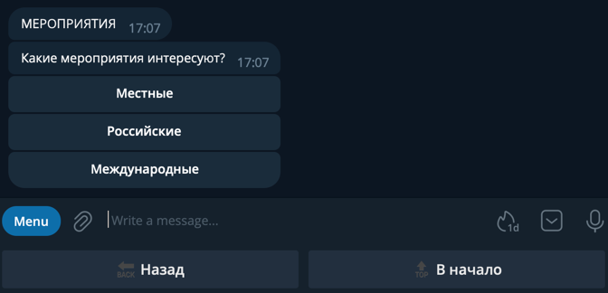

# Задачи для реализации

- task 1: Работа с заказами дизайнеров в разделе Биржа услуг (done)
- task 2: Поиск поставщика (done)
- task 3: Добавление рекомендованного пользователя (done) 
- task 4: Добавление пользователей в группах телеграм (done) 
- task 5: Доработать логику изменения данных пользователя в разделе Мой Профиль (done) 
- task 6: Реализовать отображение списка Избранное в разделе Мой Профиль (done) 
- task 7: [Реализовать поиск мероприятий в интернете и отобразить в разделе События](#task7) 

###  Реализовать поиск мероприятий в интернете и отобразить в разделе События

Смотреть на такие сервисы как: Google Calendar, Eventbrite, Meetup
https://www.expoclub.ru/search/?q=&profile=12844&date_from=31.12.2023&date_to=31.12.2024&type=44
https://expomap.ru/expo/search/?q=дизайн+интерьера&th=16&th=42&sType=exhb&fr=31.12.2023&to=31.12.2024
https://worldexpo.pro/events?sector=dizayn-interera

## Заметки на будущее
- вынести в настройки опцию "Удалять выполненные заказы по завершению".
- показывать списки любых данных группами по 20 записей и добавлять кнопку 'Показать еще'.
- предлагать дизайнеру при создании заказа на бирже отмечать какие контакты отображать для связи с исполнителем.