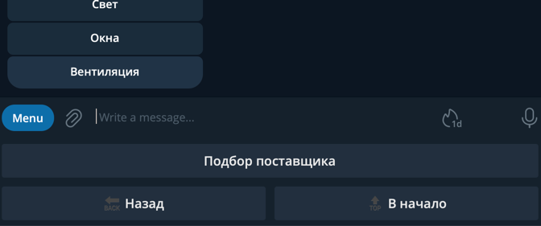
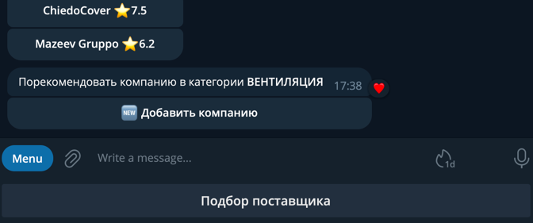
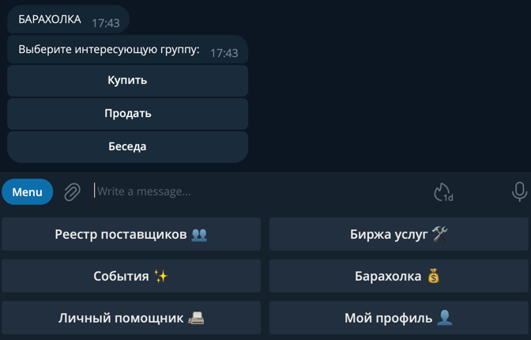
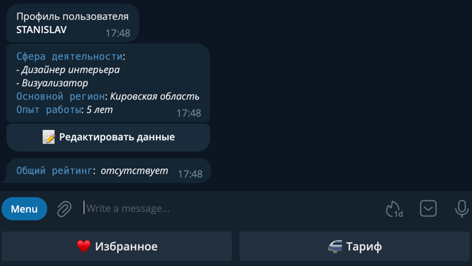

# Задачи для реализации

- task 1: [Работа с заказами дизайнеров в разделе Биржа услуг](#task1)
- task 2: [Подбор поставщика для группы Дизайнеры](#task2)
- task 3: [Добавление рекомендованного пользователя](#task3) 
- task 4: [Разработка логики регистрации пользователей в группах телеграм](#task4) 
- task 5: [Доработать логику изменения данных пользователя в разделе Мой Профиль](#task5) 
- task 6: [Реализовать отображение списка Избранное в разделе Мой Профиль](#task6) 
- task 7: [Реализовать поиск мероприятий в интернете и отобразить в разделе События](#task7) 

###  Работа с заказами дизайнеров в разделе Биржа услуг
Требуется реализовать функционал для работы с заказами на бирже услуг.
Пользователь может быть дизайнером или аутсорсером или тем и другим. Необходимо учитывать это при отображении кнопок клавиатуры. В случае если пользователь входит в обе группы 0 и 1, то есть является и заказчиком и исполнителем, отображаются все кнопки клавиатуры в разделе Биржа услуг

#### группа пользователей Аутсорсер
Аутсорсер на бирже услуг видит только категории, в которых есть активные заказы. Если статус заказа Выполнен или срок выполнения истек, то такие заказы не должны попадать в категорию.
В разделе Биржа услуг доступны две кнопки: _Мои заказы_ и _Все заказы_. 

*Необходимо сделать:*
1. Нажимая на кнопки с названиями заказов (см изображение) выводить сообщение с полным описанием полей заказа модели Order и добавить инлайн кнопку «Откликнуться». 
2. Нажимая на кнопку Откликнуться, менять значение заказа (поле status). 
3. При нажатии на кнопку «Все заказы» отображать список всех заказов размещенных на бирже для текущей категории со статусом Новый. 
4. При нажатии на кнопку «Мои заказы», отображать взятые заказы дизайнера, у которых в поле executor указан id текущего аутсорсера.
5. Если Аутсорсер заходит в категорию, то должен видеть только новые заказы дизайнеров для этой категории

#### группа пользователей Дизайнер
1. Нажимая на кнопку «Новый заказ», предлагать ввести все данные заказа модели Order: короткое название, описание, дата завершения. Для нового заказа установить статус: новый
2. При нажатии на кнопку «Мои заказы», отображать всех заказов дизайнера.  

#### группа пользователей Дизайнер и Аутсорсер
Для этой группы будут видны кнопки: Новый заказ, Мои заказы, Все заказы. Кроме этого, если перейти в категорию, то там после списка всех заказов дизайнеров должна появиться инлайн кнопка «Новый заказ». Функционал почти целиком совпадает с обычной кнопкой Новый заказ, исключение только в том, что в текущей категории не надо выбирать ее, а в другом случае необходимо указать категорию, так как кнопка Мои заказы доступна при открытии раздела Биржа услуг где отображается список всех категорий аутсорсеров. 

###  Подбор поставщика в разделе Реестр Поставщика

###  Добавление рекомендованного пользователя

###  Разработка логики регистрации пользователей в группах телеграм

###  Добавить логику изменения данных пользователя в разделе Мой Профиль

###  Реализовать отображение списка Избранное в разделе Мой Профиль

###  Реализовать поиск мероприятий в интернете и отобразить в разделе События

